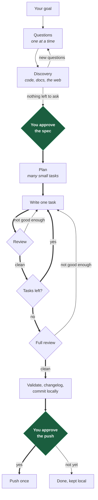

# My Plan

**Describe a goal. Approve a spec once. Get reviewed code.**

Two independent, installable plugins — one for Claude Code and one Codex-only —
carry one approved specification through planning, implementation, validation,
independent review, and delivery. Three commands. No runtime is installed into
your project.

---

## Why

Asking an agent to "build the feature" gives you a large diff, written in one long
session, reviewed by the same model that wrote it, if at all. It usually looks
right.

My Plan does the opposite of all three:

**Small tasks.** A goal becomes many precise tasks instead of one ambitious one.
Writers hold a limited working context and degrade over a long session, so each
task is a handful of files and one idea.

**Reviewed as it lands.** Every task is reviewed the moment it is delivered, not
at the end. A defect found now is one small correction; the same defect found ten
tasks later is a large diff against a session that has moved on.

**Never its own reviewer.** The model that wrote the code is never the model that
approves it. Not in any mode, not in any fallback.

You are asked once before mutation: do you approve this spec. Work then continues
through local commits without interruption; a separate push confirmation controls
whether anything leaves your machine.

---

## Install

Install the plugin once for your host, then initialize each repository the first
time you use it there. You may install either distribution or both; they do not
depend on each other and do not share resumable Run state.

### Claude Code

```bash
/plugin marketplace add anthonydaros/my-plan-claude-plugin
/plugin install my-plan@my-plan
```

### Codex

```bash
codex plugin marketplace add anthonydaros/my-plan-claude-plugin
codex plugin add my-plan@my-plan-codex
```

Start a new Codex session after installing or updating so its bundled skills
reload. The Codex marketplace is `my-plan-codex`; the plugin remains `my-plan`.

### Once per repository

| Host | Initialize |
|------|------------|
| Claude Code | `/my-plan:install` |
| Codex | `$my-plan:install` |

Setup reads the repository and records the verified stack, package manager,
module boundaries, validation commands, default branch, remotes, and CI. It asks
only what the code cannot answer.

Repository facts live at `.claude/skills/my-plan-project/` for Claude Code or
`.agents/skills/my-plan-project/` for Codex. Both distributions use
`docs/my-plan/SEAM.md` and `docs/my-plan/runs/`. Existing agent instructions,
skills, and documentation are never modified.

The first run on a machine probes the selected host and records its preferences
outside the repository. You may skip explicit setup: the host's `start` command
runs it when needed. Direct setup materializes project files in the checkout;
implicit setup keeps them outside it until spec approval creates the worktree.

Append `repair`, `reconfigure`, or `migrate` to the install command:

| Mode | What it does |
|------|--------------|
| `repair` | Re-probes and repairs missing capabilities without discarding answers |
| `reconfigure` | Keeps verified facts and re-asks model and workflow preferences |
| `migrate` | Moves managed files to the current schema and stops on unrecognized edits |

Setup resumes rather than restarting after a missing prerequisite is fixed.

### Requirements

| Distribution | Required | Optional |
|--------------|----------|----------|
| Claude Code | Claude Code 2.1.216+, Git 2.28+, Context7 | Codex CLI, GitHub CLI, Playwright |
| Codex-only | Codex CLI with `exec`, Git 2.28+, Context7, distinct Sol and Terra mappings | GitHub CLI, Playwright |

The Codex-only distribution never falls back to Claude. Quota, authentication,
or an unavailable independent model leaves the Run blocked and resumable.

### Updating Codex

Published Codex changes advance the semantic version in
`codex-plugin/.codex-plugin/plugin.json`. Refresh and reinstall from Git with:

```bash
codex plugin marketplace upgrade my-plan-codex
codex plugin add my-plan@my-plan-codex
```

During local development, replace a single `+codex.<cachebuster>` suffix instead
of incrementing the release version for every test. Start a new session after
either update.

---

## Commands

| Action | Claude Code | Codex |
|--------|-------------|-------|
| Start a goal | `/my-plan:start <goal>` | `$my-plan:start <goal>` |
| Resume | `/my-plan:start` | `$my-plan:start` |
| Audit | `/my-plan:audit [focus]` | `$my-plan:audit [focus]` |
| Setup | `/my-plan:install [mode]` | `$my-plan:install [mode]` |

---

## The flow



**Before the green box: it asks until it stops having doubts.** You answer up to
ten questions. It takes your answers back to the code, and to the web when the
goal turns on business rules, a market, a regulation, or a standard the repository
never mentions. That usually raises questions it could not have asked before, so
it asks again. The loop repeats until a round produces nothing that would change
scope or behavior. Only then are you asked to approve.

**Between the green boxes: nothing ships until review is satisfied.** Every task
goes write, review, back to the writer, review again, until that task is clean.
Then the whole change is reviewed, and anything it finds goes back to the writer
too. The loop does not exit on a round count or a timer; it exits when there is
nothing left to fix.

**At the second green box: nothing leaves your machine without you.** It commits
as it goes, so you get real history to read, but it does not push. At the end it
shows you what was built, the commits, and what was validated, and asks. One push
for the whole run, after you say so.

Say no and the run is still complete: the work is committed and waiting on its
branch. That is a finished run, not a failed one.

You appear twice: to approve the spec, and to approve the push.

---

## What a run looks like

```text
# Claude Code
/my-plan:start add rate limiting to the public API

# Codex
$my-plan:start add rate limiting to the public API
```

1. **It reads your repository first.** Anything the code can answer, it does not
   ask you.
2. **It asks what is genuinely open.** One question at a time, each with a
   recommendation you can accept or override. Ten at most in this round.
3. **It goes and finds out.** Your answers point at code it had not read and at a
   domain it had not researched. It reads both, and searches the web when the
   business, the market, or a regulation matters more than the code does.
4. **It asks again.** Whatever step 3 exposed, up to fifteen more. Then repeats
   steps 3 and 4 for as long as each round is still resolving something material.
   Ambiguity it cannot resolve is written into the spec as a flagged assumption,
   never guessed silently.
5. **You approve a spec.** One paragraph and a link. Say yes in ordinary words.
   This is the only approval before local work, and it comes after the doubts are
   gone.
6. **It builds, in a loop.** One small task at a time: written, checked,
   reviewed. Findings go back to the writer one at a time and it reviews again.
   Nothing advances to the next task until this one is clean.
7. **It reviews the whole thing.** Per-task review misses what emerges between
   tasks. Anything the full review finds goes back to the writer, and it runs
   again. Repeat until clean.
8. **It commits.** Validation gate, changelog, and commits along the way. Before
   every commit it scans what is staged for credentials, keys, env files, and
   anything else that should not be published, including in its own notes.
9. **It asks before pushing.** What was built, the commits, what was validated,
   where it would go. Say `yes`, `sim`, or `push`. One push for the whole run.
10. **You get a short report.** What was done, what was validated, the commit, and
    the verified remote SHA if you pushed.

---

## What it will never do

- Touch your working checkout. Work happens in an isolated worktree.
- Change anything before you approve.
- Modify a file outside the approved scope.
- Run `git add -A`.
- **Push anything without asking you first.** Not a branch, not a tag, not "just
  the docs".
- Open a PR, force push, or rewrite history.
- Commit a credential. Every staged set is scanned before every commit, because a
  secret committed once stays in history even if the next commit removes it.
- Deploy. Delivery is not deployment; that needs its own approval.
- Let the model that wrote the code decide whether the code is good.

Change the scope and it asks again. Change the code after review and validation
and review run again.

---

## Who does what

Nobody reviews their own work.

| Job | Codex-only | Claude Code |
|-----|------------|-------------|
| Discovery | Terra, high ×2 | Sonnet, high ×2 |
| Write the plan | Sol, high | Opus, high |
| Review the plan | Terra, high | Sonnet, high |
| Write the code | Terra, high | Sonnet, high |
| Review the code | Sol, high ×2 | Opus, high |

The Codex package runs every Worker through `codex exec`. Review and discovery
receive a process-enforced read-only sandbox; planning and implementation receive
workspace-write. Sol and Terra must resolve to different model IDs. A missing
model, quota, or authentication blocks the Run with its work preserved.

The Claude package keeps its existing Codex-first hybrid mapping and its complete
Claude-only path. Installing the Codex package does not change that behavior.

---

## Several at once

Open two terminals, start two runs in the same repository. Each gets its own run
ID, branch, worktree, state, and review hashes.

Overlapping files are reported as integration risk, not blocked. Integration uses
short optimistic locks, and no lock is ever held while a model is thinking.

---

## What lands in your repository

```
docs/my-plan/SEAM.md                  current architecture, one file
docs/my-plan/runs/<run>/              one document per phase that ran
.claude/skills/my-plan-project/       verified facts for Claude Code
.agents/skills/my-plan-project/       verified facts for Codex
CHANGELOG.md                          or whatever your repo already uses
```

Run state, worktrees, and locks live outside your repository, in an app data
directory. They survive terminal closure, restarts, and plugin updates.
The selected host's install command prints the path. Codex state uses
`~/.codex/plugins/data/my-plan-my-plan/`; Claude state remains in its existing
host data directory.

No database. No daemon. No transcripts in your repo.

---

## Troubleshooting

**Claude commands do not appear.** Check `claude --version` for 2.1.216+, then
`/reload-plugins`. The reload summary can report `0 skills` while they did reload.

**Codex skills do not appear.** Run `codex plugin list --json`, confirm
`my-plan@my-plan-codex` is installed and enabled, then start a new session.

**`/start` not found, but `/my-plan:start` works.** Another command owns the
short name. Expected.

**An agent does not run.** A project or user agent with the same name wins over a
plugin agent. Check `.claude/agents/` and `~/.claude/agents/`.

**Codex reports one model for Sol and Terra.** Run `$my-plan:install reconfigure`
and provide a distinct mapping. One model cannot write and review the subject.

**It asked something obvious.** Worth reporting. Repository facts should come from
the scan, not from you.

**A run is `BLOCKED`.** Reviews stopped making progress, or the base branch kept
moving. Nothing was committed; the report says what is open.

**You want a dry run.** `/my-plan:audit` and `$my-plan:audit` are read-only by
construction.

---

## Uninstall

```bash
# Claude Code
/plugin uninstall my-plan@my-plan

# Codex
codex plugin remove my-plan@my-plan-codex
```

Uninstalling either package does not delete its external Run state. The host's
install command reports that path if you want to remove it separately.

---

MIT
