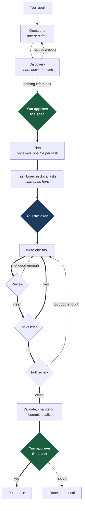

# My Plan

**Describe a goal. Approve a spec once. Get a task board. Execute it when you
decide. Get reviewed code.**

Two independent, installable plugins — one for Claude Code and one Codex-only —
carry one approved specification through planning, isolated implementation,
validation, independent review, and delivery, split into two commands: `start`
plans, `exec` executes, and nothing is built until you run the second one. Four
commands. No runtime is installed into your project.

---

## Why

Asking an agent to "build the feature" gives you a large diff, written in one long
session, reviewed by the same model that wrote it, if at all. It usually looks
right.

My Plan does the opposite of all three:

**Small tasks.** A goal becomes many precise tasks instead of one ambitious one.
Writers hold a limited working context and degrade over a long session, so each
task is a handful of files and one idea.

**Reviewed as it lands.** Every task is reviewed the moment it is delivered, not
at the end. A defect found now is one small correction; the same defect found ten
tasks later is a large diff against a session that has moved on.

**Never its own reviewer.** The model that wrote the code is never the model that
approves it. Not in any mode, not in any fallback.

**And it stops between planning and building.** `start` ends with an approved
spec and a reviewed task board — one file per task in `docs/tasks/`, yours to
read and edit. Nothing is implemented until you run `exec`. You are asked to
approve once, before the board is written; execution then works through local
commits without interruption, and a separate push confirmation controls whether
anything leaves your machine.

---

## Install

Install the plugin once for your host, then initialize each repository the first
time you use it there. You may install either distribution or both; they do not
depend on each other and do not share resumable Run state.

### Claude Code

```bash
/plugin marketplace add anthonydaros/my-plan-claude-plugin
/plugin install my-plan@my-plan
```

### Codex

```bash
codex plugin marketplace add anthonydaros/my-plan-claude-plugin
codex plugin add my-plan@my-plan-codex
```

Start a new Codex session after installing or updating so its bundled skills
reload. The Codex marketplace is `my-plan-codex`; the plugin remains `my-plan`.

### Once per repository

| Host | Initialize |
|------|------------|
| Claude Code | `/my-plan:install` |
| Codex | `$my-plan:install` |

Setup reads the repository and records the verified stack, package manager,
module boundaries, validation commands, default branch, remotes, and CI. It asks
only what the code cannot answer.

Repository facts live at `.claude/skills/my-plan-project/` for Claude Code or
`.agents/skills/my-plan-project/` for Codex. Run paperwork stays outside your
repository and is deleted when a run completes; while a run is planned, its
tasks sit as one file each in `docs/tasks/`, and the only permanent record is
the changelog. Existing agent instructions, skills, and documentation are never
modified.

The first run on a machine probes the selected host and records its preferences
outside the repository. You may skip explicit setup: the host's `start` command
runs it when needed. Only the install command materializes project files in the
checkout; a run keeps its own facts outside it.

Append `repair`, `reconfigure`, or `migrate` to the install command:

| Mode | What it does |
|------|--------------|
| `repair` | Re-probes and repairs missing capabilities without discarding answers |
| `reconfigure` | Keeps verified facts and re-asks model and workflow preferences |
| `migrate` | Moves managed files to the current schema and stops on unrecognized edits |

Setup resumes rather than restarting after a missing prerequisite is fixed.

**Upgrading from an earlier version.** Repositories initialized by the dossier
format — the ones with `docs/my-plan/` committed — are upgraded by
`/my-plan:install migrate` (Codex: `$my-plan:install migrate`), and plain
install detects the old format and enters the same migration by itself, so
re-running install on an installed repository is always the right move. It
upgrades the plugin's state and project skill, asks once whether to delete the
legacy `docs/my-plan/` files from your working tree — you commit that change
yourself; migration never commits or pushes — and triages unfinished runs:
pre-approval runs resume as-is, and mid-implementation runs get a per-run
choice of convert (one fresh approval of the trimmed spec; branch, worktree,
and commits all preserved), cancel, or leave blocked.

### Requirements

| Distribution | Required | Optional |
|--------------|----------|----------|
| Claude Code | Claude Code 2.1.216+, Git 2.28+ | Context7, Codex CLI, GitHub CLI, Playwright, other MCP/LSP tools |
| Codex-only | Codex CLI with `exec`, Git 2.28+, distinct Sol and Terra mappings | Context7, GitHub CLI, Playwright, other MCP/LSP tools |

Optional tools are probed at setup and used when present — a documentation MCP
for library docs, an indexing MCP or LSP for code navigation. None is ever a
dependency; a missing one only changes speed.

### Updating Codex

Published Codex changes advance the semantic version in
`codex-plugin/.codex-plugin/plugin.json`. Refresh and reinstall from Git with:

```bash
codex plugin marketplace upgrade my-plan-codex
codex plugin add my-plan@my-plan-codex
```

During local development, replace a single `+codex.<cachebuster>` suffix instead
of incrementing the release version for every test. Start a new session after
either update.

---

## Commands

| Action | Claude Code | Codex |
|--------|-------------|-------|
| Plan a goal | `/my-plan:start <goal>` | `$my-plan:start <goal>` |
| Execute the plan | `/my-plan:exec [run]` | `$my-plan:exec [run]` |
| Resume planning | `/my-plan:start` | `$my-plan:start` |
| Resume execution | `/my-plan:exec` | `$my-plan:exec` |
| Audit | `/my-plan:audit [focus]` | `$my-plan:audit [focus]` |
| Setup | `/my-plan:install [mode]` | `$my-plan:install [mode]` |

`start` ends at a reviewed task board; `exec` picks it up whenever you decide —
minutes or weeks later. Cancel a planned run by asking either command.

Both distributions read and write the same repository-side structure —
`docs/tasks/` and the changelog — so the board is host-neutral and human-
readable. Each run is executed by the host that planned it, because that host
holds the run's approval state.

---

## The flow



**Before the green box: it asks until it stops having doubts.** You answer up to
ten questions. It takes your answers back to the code, and to the web when the
goal turns on business rules, a market, a regulation, or a standard the repository
never mentions. That usually raises questions it could not have asked before, so
it asks again. The loop repeats until a round produces nothing that would change
scope or behavior. Only then are you asked to approve.

**At the blue box: nothing is built until you say when.** `start` parks the run
with its reviewed tasks in `docs/tasks/`, one file each — read them, edit them,
or cancel. `exec` verifies the spec and the board are exactly what was approved
and reviewed (an edit triggers one more plan review), then builds. It is not a
third approval: the spec approval already authorized the work, and running
`exec` just decides when.

**Between the green boxes: nothing ships until review is satisfied.** Every task
goes write, review, back to the writer, review again, until that task is clean.
Then the whole change is reviewed, and anything it finds goes back to the writer
too. The loop does not exit on a round count or a timer; it exits when there is
nothing left to fix.

**At the second green box: nothing leaves your machine without you.** It commits
as it goes, so you get real history to read, but it does not push. At the end it
shows you what was built, the commits, and what was validated, and asks. One push
for the whole run, after you say so.

Say no and the run is still complete: the work is committed and waiting on its
branch. That is a finished run, not a failed one.

You appear three times: to approve the spec, to run `exec`, and to approve the
push. The first and last are approvals; the middle one is scheduling.

---

## What a run looks like

```text
# Claude Code
/my-plan:start add rate limiting to the public API

# Codex
$my-plan:start add rate limiting to the public API
```

1. **It reads your repository first.** Anything the code can answer, it does not
   ask you.
2. **It asks what is genuinely open.** One question at a time, each with a
   recommendation you can accept or override. Ten at most in this round.
3. **It goes and finds out.** Your answers point at code it had not read and at a
   domain it had not researched. It reads both, and searches the web when the
   business, the market, or a regulation matters more than the code does.
4. **It asks again.** Whatever step 3 exposed, up to fifteen more. Then repeats
   steps 3 and 4 for as long as each round is still resolving something material.
   Ambiguity it cannot resolve is written into the spec as a flagged assumption,
   never guessed silently.
5. **You approve a spec.** One paragraph and a link. Say yes in ordinary words.
   This is the only approval before local work, and it comes after the doubts are
   gone.
6. **It plans, and an independent model reviews the plan.** Then `start` stops:
   the tasks land as one file each in `docs/tasks/`, and you get the board and
   the next command. Read the tasks. Edit them if you want. Wait as long as you
   want.

```text
# Claude Code
/my-plan:exec

# Codex
$my-plan:exec
```

7. **It checks the board is still what was reviewed.** The spec hash, the plan
   hash, every task file. Your edits get one more plan review; drift in the
   repository since planning gets caught here too. Then it creates the isolated
   worktree and starts.
8. **It builds, in a loop.** One small task at a time: written, checked,
   reviewed. Findings go back to the writer one at a time and it reviews again.
   Nothing advances until this task is clean — and its file disappears from
   `docs/tasks/`, so the shrinking folder is your progress bar.
9. **It reviews the whole thing.** Per-task review misses what emerges between
   tasks. Anything the full review finds goes back to the writer, and it runs
   again. Repeat until clean.
10. **It commits.** Validation gate, changelog, and commits along the way. Before
    every commit it scans what is staged for credentials, keys, env files, and
    anything else that should not be published, including in its own notes.
11. **It asks before pushing.** What was built, the commits, what was validated,
    where it would go. Say `yes`, `sim`, or `push`. One push for the whole run.
12. **You get a short report.** What was done, what was validated, the commit, and
    the verified remote SHA if you pushed.

---

## What it will never do

- Touch your working checkout, beyond its own task files in `docs/tasks/`. Code
  is written in an isolated worktree, and the task files are never committed.
- Change anything before you approve, or build anything before you run `exec`.
- Modify a file outside the approved scope.
- Run `git add -A`.
- **Push anything without asking you first.** Not a branch, not a tag, not "just
  the docs".
- Open a PR, force push, or rewrite history.
- Commit a credential. Every staged set is scanned before every commit, because a
  secret committed once stays in history even if the next commit removes it.
- Deploy. Delivery is not deployment; that needs its own approval.
- Let the model that wrote the code decide whether the code is good.

Change the scope and it asks again. Change the code after review and validation
and review run again.

---

## Who does what

Nobody reviews their own work. Two properties decide who holds which job.
**Width** is how much a Worker can hold at once — what discovery, a
whole-repository audit, and a large diff need. **Depth** is how hard it reasons
about one tangled thing — what a plan, a product judgement, and a concurrency bug
need.

Every Worker also carries a reasoning effort. `high` is the working default
everywhere; `xhigh` and `max` are escalations spent on one hard problem, not a
setting to leave on.

| Job | Codex-only | Claude Code, GPT available | Claude Code, Claude only |
|-----|------------|----------------------------|--------------------------|
| Discovery | Terra, high ×2 | Terra, high ×2 | Sonnet, high ×2 |
| Findings review | Sol, xhigh | Opus, high | Opus, high |
| Write the plan | Sol, high | Sol, high | Opus, high |
| Review the plan | Terra, high | Terra, high | Sonnet, high |
| Write the code | Terra, high | Terra, high | Sonnet, high |
| Technical code review | Sol, high | Sol, high | Opus, high |
| Product review | Sol, high | Sol, high | Opus, high |
| QA gate | Sol, high | Sol, high | Opus, high |
| Audit | Terra, high | Terra, high | Sonnet, high |
| Commit | Terra, high | Sonnet, high | Sonnet, high |

In Claude Code, **GPT takes every job it can hold and Claude takes what is left**.
Claude still runs four jobs there regardless: the commit, the findings review,
anything a Codex thread is too narrow to hold, and any review where the ladder
would otherwise put one model on both sides.

The Codex package runs every Worker through `codex exec`. Review, discovery, and
planning receive a process-enforced read-only sandbox — the planner returns the
plan as structured content and never writes — while implementation, the QA
gate, and the commit receive workspace-write. Sol and Terra must resolve to different model IDs. Installing
one package does not change the other's behavior.

### When a model is unavailable

Every job has an **ordered list of candidates**, not one alternate. A model that
is offline, out of quota, past a usage cap, or no longer served does not end a
run: the job advances to the next candidate and keeps going. The chains below
are the Claude Code distribution's; the Codex-only package applies the same
rules within Sol, Terra, and Luna.

| Job | 1st | 2nd | 3rd | 4th |
|-----|-----|-----|-----|-----|
| Discovery | Terra, high | Gemini Pro, high | Sonnet, high | Opus, high |
| Findings review | Opus, high | Sonnet, high | Sol, xhigh | — |
| Write the plan | Sol, high | Sol, xhigh | Opus, high | Terra, high |
| Review the plan | Terra, high | Opus, high | Sonnet, high | Luna, high |
| Write the code | Terra, high | Gemini Pro, high | Sol, xhigh | Sonnet, high |
| Technical code review | Sol, high | Sol, xhigh | Opus, high | Sonnet, high |
| Product review | Sol, high | Opus, high | Sonnet, high | — |
| QA gate | Sol, high | Terra, high | Opus, high | Sonnet, high |
| Audit | Terra, high | Gemini Pro, high | Sol, xhigh | Sonnet, high |
| Commit | Sonnet, high | Opus, high | Terra, high | Luna, high |

**A chain is a list of candidates, not a list of instructions.** The writer's
model appears somewhere on the reviewer's chain, so a chain walked blindly would
eventually put the same identity on both sides of a review — and the check that
was supposed to catch the defect becomes the model agreeing with itself. Before
taking a candidate, it is compared against whoever already holds the opposing
job in that run. If they match, it is skipped and the next one is taken.

**A chain ends. It never wraps.** When every candidate is exhausted or skipped,
the run is `BLOCKED` and says which job ran out and why. A run that stops with an
honest reason costs a re-run; one that quietly reviews its own work costs
whatever shipped.

Gemini Pro, via opencode, appears on exactly three chains — discovery,
implementation, and audit — and **never on a review chain**. Its transport
validates a result after the model runs rather than before, which is fine for
gathering evidence and for code about to be reviewed twice, and not fine for a
verdict at the end of a chain.

### What advances a chain, and what does not

| What happened | What the run does |
|---|---|
| Offline, unauthenticated, out of quota, past a usage cap, out of credits, model withdrawn | Advances immediately. No retry — the next attempt fails the same way |
| Network or provider error, transport failure | One bounded retry, then advances |
| The model returned invalid JSON or broke its contract | A failed attempt against the **same** candidate. Not a reason to advance, and never an implicit approval |
| The model did the work and the work was bad | Not a fallback at all. That is remediation, and it stays with the job that owns it |

That last row is the one worth stating: a model returning nonsense is not a model
being unavailable, and treating it as one hides a quality problem behind an
infrastructure story while quietly demoting the job.

**Raising effort is never the answer to an unavailable model.** Sol at `high`
failing on quota does not become Sol at `xhigh` — same account, same limit. The
`xhigh` entries above are for when the tier is reachable and the previous attempt
failed on the work itself.

Once a job moves down its chain it **stays there for that run**, and the move is
recorded with the phase, the error class, the candidate that failed, the one that
took over, and the time. The active candidate per job is written into the run
manifest, so a run resumed in a new session still knows who wrote what — without
it, a resumed run could hand the reviewer the model that wrote the code and pass
every check while doing it.

A fallback may reduce capability. It never merges writer and reviewer.

---

## Several at once

Open two terminals, start two runs in the same repository. Each gets its own run
ID, branch, worktree, state, and review hashes.

Overlapping files are reported as integration risk, not blocked. Integration uses
short optimistic locks, and no lock is ever held while a model is thinking.

---

## What lands in your repository

```
docs/tasks/                           one file per planned task, deleted as each completes
docs/CHANGELOG.md                     or whatever your repo already uses — the only permanent record
.claude/skills/my-plan-project/       verified facts for Claude Code (via install)
.agents/skills/my-plan-project/       verified facts for Codex (via install)
```

Everything else a run produces — discovery, the spec, the plan, review and
validation evidence, the architecture notes — lives outside your repository and
is deleted when the run completes or is cancelled. What a run did is recorded
where users of your software look: the changelog.

Run state, worktrees, and locks live outside your repository, in an app data
directory. They survive terminal closure, restarts, and plugin updates.
The selected host's install command prints the path. Codex state uses
`~/.codex/plugins/data/my-plan-my-plan/`; Claude state remains in its existing
host data directory.

No database. No daemon. No transcripts in your repo.

---

## Troubleshooting

**Claude commands do not appear.** Check `claude --version` for 2.1.216+, then
`/reload-plugins`. The reload summary can report `0 skills` while they did reload.

**Codex skills do not appear.** Run `codex plugin list --json`, confirm
`my-plan@my-plan-codex` is installed and enabled, then start a new session.

**`/start` not found, but `/my-plan:start` works.** Another command owns the
short name. Expected.

**An agent does not run.** A project or user agent with the same name wins over a
plugin agent. Check `.claude/agents/` and `~/.claude/agents/`.

**Codex reports one model for Sol and Terra.** Run `$my-plan:install reconfigure`
and provide a distinct mapping. One model cannot write and review the subject.

**It asked something obvious.** Worth reporting. Repository facts should come from
the scan, not from you.

**A run is `BLOCKED`.** Reviews stopped making progress, or the base branch kept
moving. The report says what is open, and any local commits stay safe on the
run's branch.

**`exec` says nothing is planned.** Execution only runs a board planning
produced. Run `/my-plan:start <goal>` (or `$my-plan:start`) first.

**You edited a task file between planning and execution.** Expected. `exec`
notices the changed hash, runs one plan review over the edit, and continues —
unless the edit widens the approved scope, which needs a spec revision.

**You want a dry run.** `/my-plan:audit` and `$my-plan:audit` are read-only by
construction.

---

## Uninstall

```bash
# Claude Code
/plugin uninstall my-plan@my-plan

# Codex
codex plugin remove my-plan@my-plan-codex
```

Uninstalling either package does not delete its external Run state. The host's
install command reports that path if you want to remove it separately.

---

MIT
